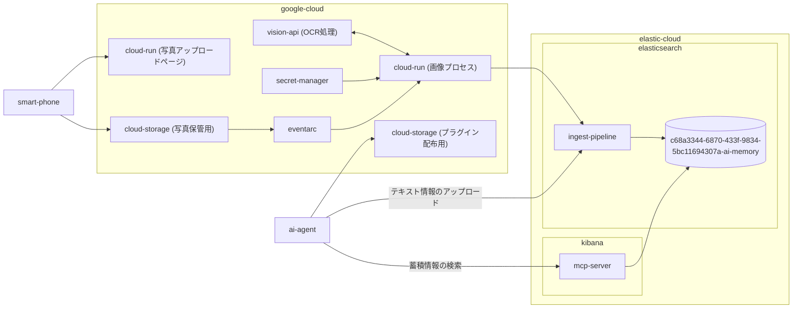

# hackathon-ai-memory

AIメモリーいらんかえ～ @ 【大阪】Zenn Agentic AI ミニハッカソン with Google Cloud

↓ リクエストや利用申し込みはGitHub issueから ↓


## このプロジェクトについて

2026/09/19開催ハッカソンの前日アイディエーションでの会話において、
@sakurai-youhei はAIに記憶を持たせるという部分に皆の共通のニーズを見出し、
ハッカソン当日に「AIメモリーいらんかえ～」と他プロジェクトを支援するために
このプロジェクトを立ち上げるに至る。

連絡やお問い合わせは上記QRコードからお気軽に。

## 「AIメモリーいらんかえ～」が提供する機能

- 写真アップロード用のURL (予定)
- ~~写真ダウンロード用のURL (予定)~~
- テキスト手入力用のURL (予定)
- 写真に写るドキュメントの文字起こし (予定)
- テキスト情報のアップロード (12:00予定)
- 写真・テキストで入力された情報の蓄積 (12:00予定)
- 自然言語で蓄積情報を検索するためエージェントプラグイン (12:00予定)
- エージェントプラグインをセットアップするための簡単ガイド

> [!CAUTION]
> ハッカソンという性質上、セキュリティ面への配慮は最低限です。
> 個人情報等、センシティブな情報は絶対にアップロードしないでください。
> またハッカソン終了後にはデータをすべて削除しますので、その点にはあらかじめご了解ください。

<details open>
<summary>利用規約</summary>

本サービスを利用することで、以下に同意したものとみなします。

- 法令および公序良俗に反する目的で利用しないこと
- 他者の権利を侵害する情報や、個人情報・機密情報を登録しないこと
- 本サービスは試験的な提供であり、提供内容や保存データを保証しないこと
- 保存されたデータは、予告なく削除される場合があること

規約は必要に応じて変更することがあります。

</details>

## セットアップ方法

hackathon-ai-memory-pluginの[プラグイン配布サイト](https://storage.googleapis.com/hackathon-ai-memory-plugin)を参照してください。

## 利用者向け API キーの発行

`.env` の `KB_ENDPOINT` を設定し、次を実行します。

```shell
make issue-api-key uuid=00000000-0000-4000-8000-000000000000
```

標準出力に表示された URL をブラウザで開き、表示された `Name` と
`Control security privileges` の JSON を使って Serverless プロジェクトの
API キーを作成します。このキーには、対象インデックスの操作権限に加えて、
デフォルト Space の Kibana Agent Builder MCP サーバーへの接続権限が含まれます。

## Architecture of AIメモリーいらんかえ～


